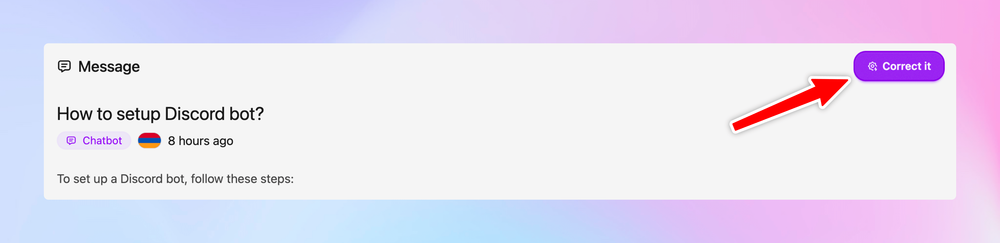

# Answer correction

It is understandable that the AI can go wrong at times. Mostly, we can idently them using the user 👎 message ratings or low rating messages. You can go through such messages and if found that the answer provided is inaccurate or incomplete, you can hi **Correct it** button which opens up a text box where you can enter the expected answer or any information in general.

It adds this information into your knowledge base under a separate group and will be used by the AI for future queries.

## Discord & Slack

On **Discord** and **Slack** channels this gets even better. If you find the bot's answer is inaccurate or incomplete, you can reply with the correct answer and react with 🧩 on the correct message. The bot adds the message into the knowledge base and uses it for future queries.