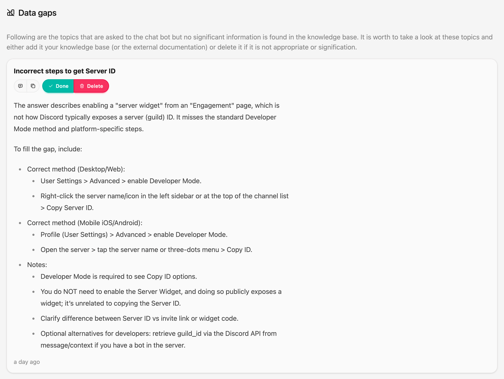

# Data gaps

One of the capabilities of CrawlChat, is to identify the Data Gaps in your documentation for the queries being asked by the users across the channels. A Data Gap can be missing information or partial information.

Whenever the AI chatbot answers a question asked by the user, it analyses the query, answer provided in background and checks if there is any Data Gap for the query asked.

It uses the scores to do the analysis along with calculating the relevance of the query asked for your knowledge base. At high level this is the flow

- Checks if the max score for the provided answer is low
- Checks how relevant the query is against your knowledge base
- If (1) is low and (2) is high, it asks AI to check if there is a data gap
- If so, it generates what is missing or can be corrected

Currently, it only creates a Data Gap alert and more tools will be added soon around it. You can *Cancel* a Data Gap alert if it is not relevant. Or you can consider it, update your documentation and mark it *Done*.

