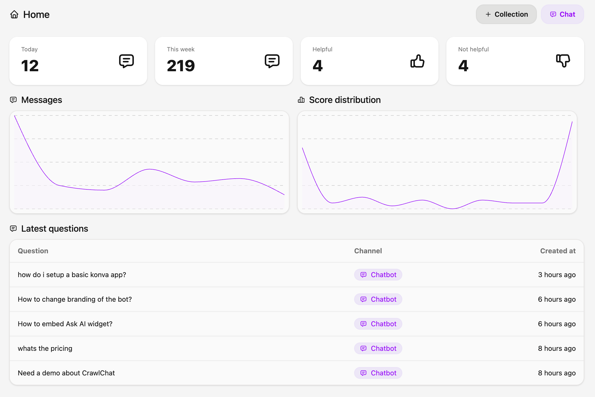
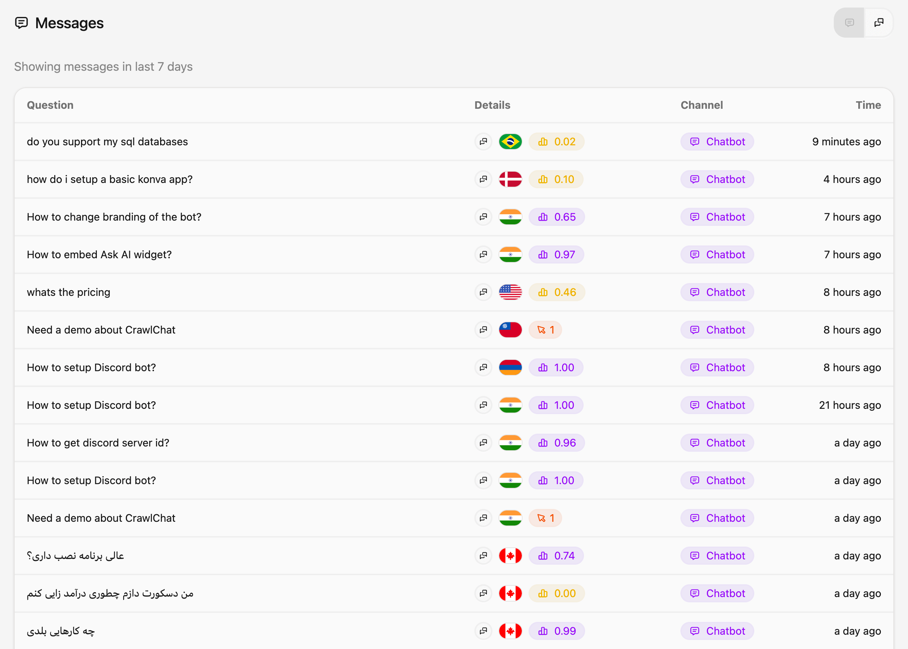
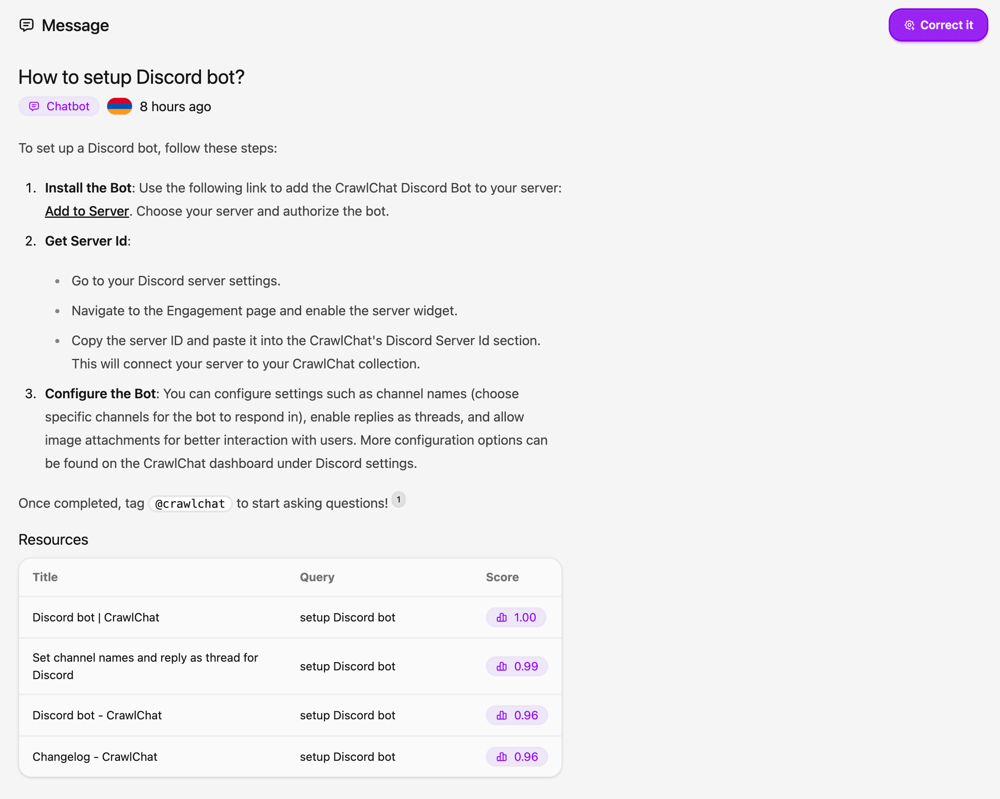

# Stats & Conversations

CrawlChat provides useful stats and analysis so that you get to know how the chatbot is performing across all the channels. Most of the analysis on CrawlChat is based on the score given to the context (RAG chunks) it fetches for the questions. This score varies from 0 to 1 where 0 means the fetched context is irrelevant and 1 represents high relevance for the given query. Here are few stats it shows from the dashboard. All the information is for last 7 days

- Messages it answered today
- Messages it answered this week
- 👍 rated messages
- 👎 rated messages
- Day vs number of messages graph
- Score distribution graph

You can view all the past messages and answeres give from [Messages](https://crawlchat.app/messages) page. It shows following data points for each question

- The question asked by the user
- The maximum score from the contexts it fetched (more, better)
- Message channel
- The country of the user (if web chatbot)

You can open a message and find out the answer the chatbot provided, the contexts it fetched, the queries it used. All this information give you more visibility and make the documentation better and tweak the chatbot behaviour by the Chat prompt.

